# APDrawingGAN++

We provide PyTorch implementations for our TPAMI paper "Line Drawings for Face Portraits from Photos using Global and Local Structure based GANs".
It is a journal extension of our previous CVPR 2019 work [APDrawingGAN](https://github.com/yiranran/APDrawingGAN).

This project generates artistic portrait drawings from face photos using a GAN-based model.
You may find useful information in [preprocessing steps](preprocess/readme.md) and [training/testing tips](docs/tips.md).


## Our Proposed Framework
 
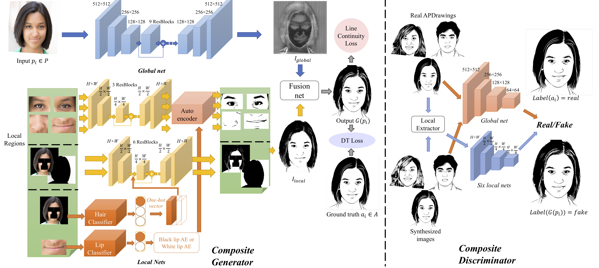

## Sample Results
Up: input, Down: output
<p>
    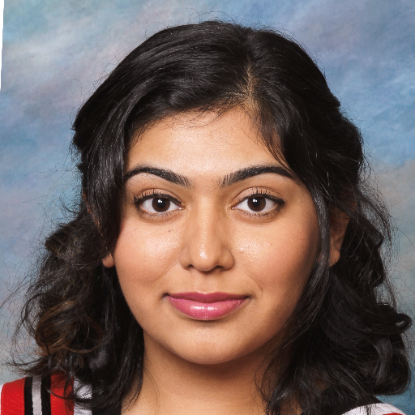
    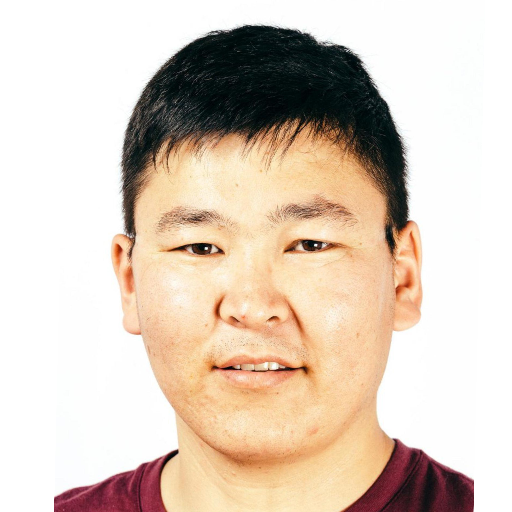
    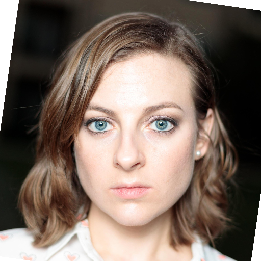
    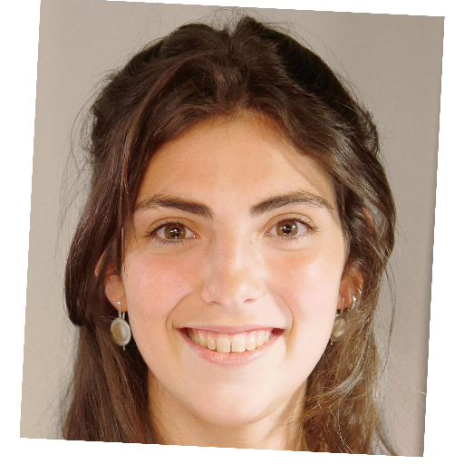
    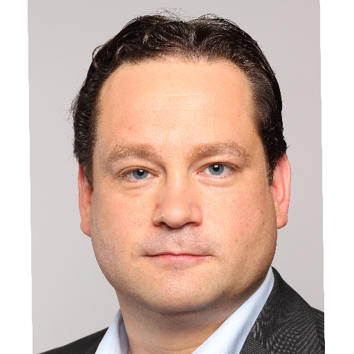
    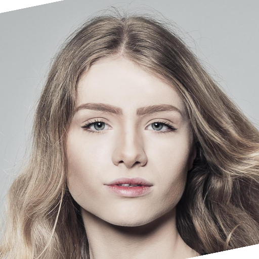
</p>
<p>
    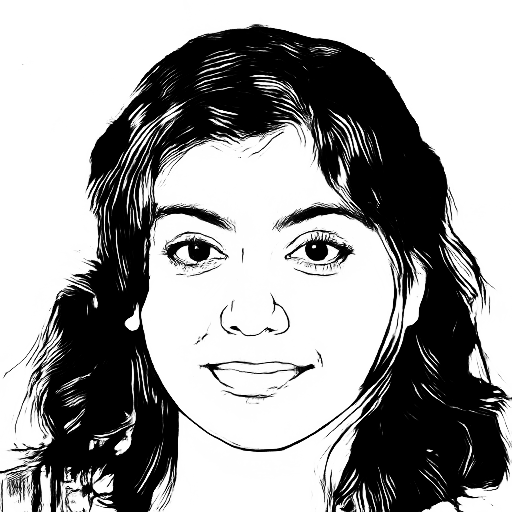
    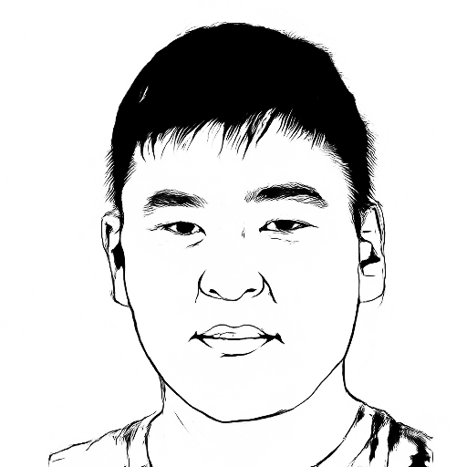
    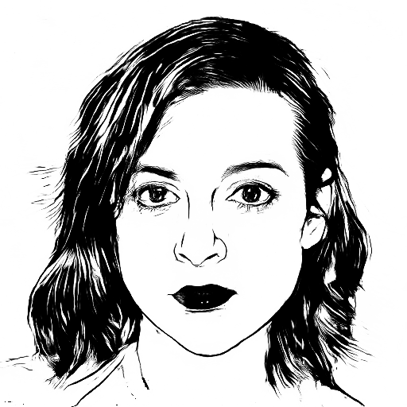
    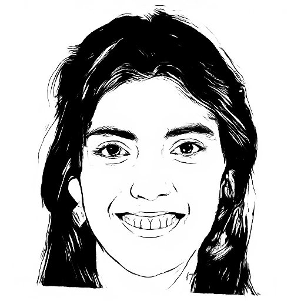
    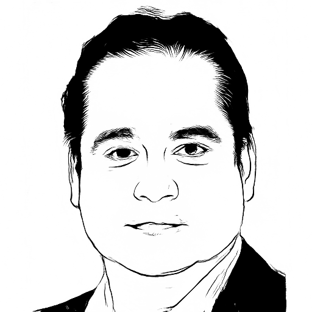
    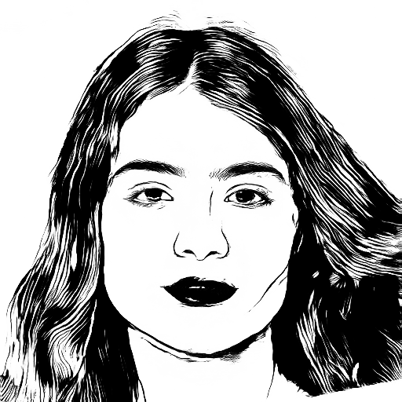
</p>

## Citation
If you use this code for your research, please cite our paper.
```
@inproceedings{YiXLLR20,
  title     = {Line Drawings for Face Portraits from Photos using Global and Local Structure based {GAN}s},
  author    = {Yi, Ran and Xia, Mengfei and Liu, Yong-Jin and Lai, Yu-Kun and Rosin, Paul L},
  booktitle = {{IEEE} Transactions on Pattern Analysis and Machine Intelligence (TPAMI)},
  year      = {2020}
}
```

## Prerequisites
- Linux or macOS
- Python 2 or 3
- CPU or NVIDIA GPU + CUDA CuDNN


## Getting Started
### 1.Installation
```bash
pip install -r requirements.txt
```

### 2.Quick Start (Apply a Pre-trained Model)
- Download APDrawing dataset from [BaiduYun] or [YandexDrive], and extract to `dataset`.

- Download pre-trained models and auxiliary nets from [BaiduYun] or [YandexDrive], and extract to `checkpoints`.

- Generate artistic portrait drawings for example photos in `dataset/test_single` using
``` bash
python test.py --dataroot dataset/test_single --name apdrawinggan++_author --model test --use_resnet --netG resnet_9blocks --which_epoch 150 --how_many 1000 --gpu_ids 0 --gpu_ids_p 0 --imagefolder images-single
```
The test results will be saved to a html file here: `./results/apdrawinggan++_author/test_150/index-single.html`.

- If you want to test on your own data, please first align your pictures and prepare your data's facial landmarks and masks according to tutorial in [preprocessing steps](preprocess/readme.md), then change the --dataroot flag above to your directory of aligned photos.

### 3.Train
- Run `python -m visdom.server`
- Train a model (with pre-training as initialization):
first copy "pre2" models into checkpoints dir of current experiment, e.g. `checkpoints/apdrawinggan++_1`.
```bash
mkdir checkpoints/apdrawinggan++_1/
cp checkpoints/pre2/*.pt checkpoints/apdrawinggan++_1/
python train.py --dataroot dataset/AB_140_aug3_H_hm2 --name apdrawinggan++_1 --model apdrawingpp_style --use_resnet --netG resnet_9blocks --continue_train --continuity_loss --lambda_continuity 40.0 --gpu_ids 0 --gpu_ids_p 1 --display_env apdrawinggan++_1 --niter 200 --niter_decay 0 --lr 0.0001 --batch_size 1 --emphasis_conti_face --auxiliary_root auxiliaryeye2o
```
- To view training results and loss plots, click the URL http://localhost:8097. To see more intermediate results, check out  `./checkpoints/apdrawinggan++_1/web/index.html`

### 4.Test
- To test the model on test set:
```bash
python test.py --dataroot dataset/AB_140_aug3_H_hm2 --name apdrawinggan++_author --model apdrawingpp_style --use_resnet --netG resnet_9blocks --which_epoch 150 --how_many 1000 --gpu_ids 0 --gpu_ids_p 0 --imagefolder images-apd70
```
The test results will be saved to a html file: `./results/apdrawinggan++_author/test_150/index-apd70.html`.

- To test the model on images without paired ground truth, same as 2. Apply a pre-trained model.

You can find these scripts at `scripts` directory.


## [Preprocessing Steps](preprocess/readme.md)
Preprocessing steps for your own data (either for testing or training).


## [Training/Test Tips](docs/tips.md)
Best practice for training and testing your models.

You can contact email yr16@mails.tsinghua.edu.cn for any questions.

## Acknowledgments
Our code is inspired by [pytorch-CycleGAN-and-pix2pix](https://github.com/junyanz/pytorch-CycleGAN-and-pix2pix).
